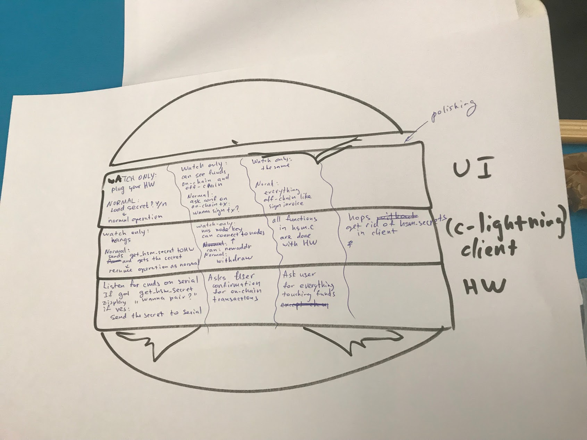

# Goal

Below we sketch out a desirable "dream state" of all the stuff we'd like
to do if we can get to it.

## Layers

To realize the UI flows described below, we can structure the work into several
layers:

- UI layer: what's shown to the user, on both client and hardware device
- client layer: what's running on the laptop
- hardware layer: what's running on the Arduino devices

## Flow 1: Viewing wallet

1. GUI starts in "watch-only mode"
  - can view onchain and offchain funds
  - can't route payments in this state
  - GUI shows "plug in your hardware device"
  - GUI is either web UI or native desktop app, showing state from c-lightning
  - when user plugs in hw device, it shows "computer wants to run a lightning node. accept?"
  - bonus: hw device asks for password or PIN before syncing

1b. Onchain wallet deposit and withdraw
  - UI maybe is bonus

## Flow 2: Payment

2. We visit some web store that accepts LN in browser, get a LN invoice, paste it in desktop app GUI
  - HW device shows confirmation screen saying that LN node wants to pay X sat to Y pubkey with description Z
  - When user confirms, payment is signed, published, and received by webshop

## Flow 3: Channel management

3. Opening a channel also should need hw device confirmation
  - "You want to open channel X towards node with pubkey Y with balance Z"
4. Closing a channel should also need user interaction
  - Otherwise malicious closure could weaken privacy or steal your coins (need to confirm second)

## Flow 4: Generate invoice

- There should be no need to have user accept here, since they are creating an invoice to pay them money..
- Bonus: Would be cool to have UI option to confirm first generation of invoice, since fraud monitoring by staying online almost all the time is necessary at that point

